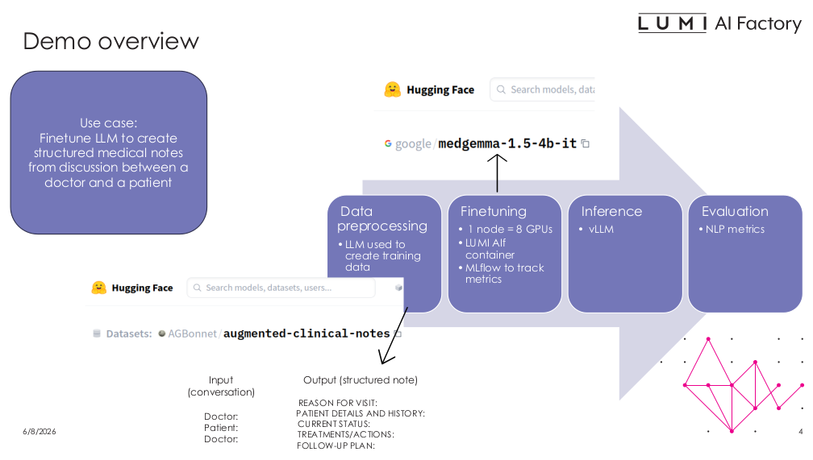

# Health LLM Finetuning Demo


This demo fine-tunes MedGemma-1.5-4B on doctor–patient conversations to generate structured clinical notes.
It covers four steps: data preprocessing, fine-tuning, inference, and evaluation.

## Files

| File | Description |
|---|---|
| `data_mod.py` | Data preprocessing script |
| `finetune.py` | Fine-tuning script (MedGemma-1.5--4B, 8 GPUs, PEFT) |
| `create_predictions.py` | Runs inference and saves predictions to JSON |
| `calculate_metrics.py` | Computes BLEU, ROUGE-L, and BERTScore |
| `run_finetune_8gpus.sh` | SLURM script for fine-tuning |
| `run_create_predictions.sh` | SLURM script for inference |
| `run_calculate_metrics.sh` | SLURM script for evaluation |
| `run_data_mod_vllm.sh` | SLURM script for data preprocessing |

## Steps

### 1. Data preprocessing
Creates the training dataset of (dialogue → structured note) pairs using a large LLM to augment the data.
```bash
sbatch run_data_mod_vllm.sh openai/gpt-oss-120b structured_notes.json 256
```
Arguments:
* openai/gpt-oss-120b - LLM used to augment the dataset
* structured_notes.json - JSON file name (used in finetuning codes)
* 256 - batch size (how many queries sent to vLLM server at once)

### 2. Fine-tuning
Fine-tunes MedGemma-1.5-4B using PEFT on 8 GPUs.
```bash
sbatch run_finetune_8gpus.sh
```

### 3. Inference
Generates predictions on the validation set (3,000 samples) for three models: MedGemma-4B base, MedGemma-4B fine-tuned, and MedGemma-27B base. Results are saved to a JSON file.

```bash
sbatch run_create_predictions.sh
```

### 4. Evaluation
Computes BLEU, ROUGE-L, and BERTScore against reference answers using the predictions JSON from the previous step.

```bash
sbatch run_calculate_metrics.sh
```