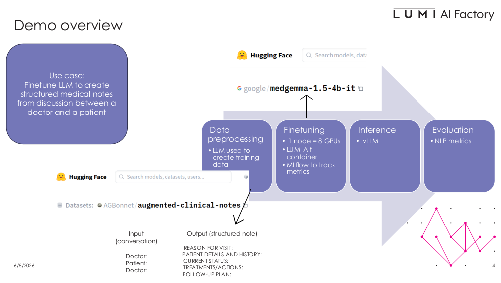

# Health LLM Finetuning Demo


This demo fine-tunes [MedGemma-1.5-4B](https://huggingface.co/google/medgemma-1.5-4b-it) on doctor–patient conversations to generate structured clinical notes.

It covers four steps: data preprocessing, fine-tuning, inference, and evaluation.

## Files

| File | Description |
|---|---|
| `data_mod.py` | Data preprocessing: creates structured notes and the train/validation/test splits|
| `finetune.py` | Fine-tuning script (MedGemma-1.5-4B, 8 GPUs, PEFT) |
| `create_predictions.py` | Runs inference on the test split and saves predictions to JSON |
| `calculate_metrics.py` | Computes BLEU, ROUGE-L, and BERTScore |
| `run_data_mod_vllm.sh` | SLURM script for data preprocessing |
| `run_finetune_8gpus.sh` | SLURM script for fine-tuning |
| `run_create_predictions.sh` | SLURM script for inference |
| `run_calculate_metrics.sh` | SLURM script for evaluation |

## Before you start

1. **Project:** the SLURM scripts use `#SBATCH --account=project_462000131`. If you use another project, change this line in all four SLURM scripts. All paths are derived from it, so nothing else needs to change.
2. **MedGemma access:** accept the model terms on Hugging Face for [MedGemma-1.5-4B](https://huggingface.co/google/medgemma-1.5-4b-it) and [MedGemma-27B](https://huggingface.co/google/medgemma-27b-it), and save your Hugging Face token to `~/.cache/huggingface/token`.

## Where the files are saved

All data files of the pipeline are saved under your own directory in the project's scratch:

```
/scratch/<project>/<user>/data/
├── <Hugging Face cache of the original dataset>
├── structured_notes/                  ← step 1
│   ├── structured_notes_full.jsonl    all rows with the generated structured notes
│   ├── train.jsonl                    80 %, used for training
│   ├── validation.jsonl               10 %, used for eval_loss during training
│   ├── test.jsonl                     10 %, used only for the final comparison
│   └── dataset_info.json              split sizes, columns, seed, source and LLM model
├── models/                            ← step 2: LoRA model and merged model
├── mlruns/                            ← step 2: MLflow tracking data
├── predictions/                       ← step 3: predictions_<jobid>.json, manifest_<runid>.json
└── metrics/                           ← step 4: metrics_<jobid>.json and plots
```

The datasets are saved as [JSON Lines](https://jsonlines.org/): one example per line. You can inspect them directly, e.g. `head -n 1 test.jsonl` or `wc -l *.jsonl`.

Downloaded models are stored in a shared cache for the whole project, `/scratch/<project>/hf-cache`, so each model is downloaded only once.

## Steps

### 1. Data preprocessing
Creates the dataset of (dialogue → structured note) pairs using a large LLM to augment the data. The structured note is created based on the `full_note` column of the [original dataset](https://huggingface.co/datasets/AGBonnet/augmented-clinical-notes) (about 30,000 rows).

```bash
sbatch run_data_mod_vllm.sh <model> <out_name> <batch_size> [max_rows]

sbatch run_data_mod_vllm.sh openai/gpt-oss-120b structured_notes 256 
```
Script arguments explained:
* openai/gpt-oss-120b - LLM used to augment the dataset
* structured_notes - name of the output directory under `/scratch/<project>/<user>/data/` (used by the later steps)
* 256 - batch size (how many queries sent to vLLM server at once)

The script first saves all rows to `structured_notes_full.jsonl`. It then drops rows where the LLM returned an empty note and splits the rest randomly into train (80 %), validation (10 %) and test (10 %) with a fixed seed (42), so the split is always the same. The split is done only here; the later steps read these files. The column names and split sizes are printed to the log and saved to `dataset_info.json`.

### 2. Fine-tuning
Fine-tunes MedGemma-1.5-4B using PEFT on 8 GPUs, using `train.jsonl` for training and `validation.jsonl` for evaluation during training. The test split is not used in this step.

```bash
sbatch run_finetune_8gpus.sh
```

**Monitor GPU usage during training:**

Check the jobid of the job with the `squeue --me` command.  

Open an interactive parallel session (replace XXXXXXX with the jobid of your job) with the following command:

````
srun --jobid XXXXXXX --interactive --pty /bin/bash
````

This will open a shell on the compute node where the job is running. We can now use the rocm-smi tool to monitor the GPU usage. The following command will show the GPU usage updated every second:

`watch -n1 rocm-smi`

<details>
  <summary>example_output.log</summary>

Here is the slurm output log from a succeeded training run. 
````
Job started at to 1.10.2026 09.00.22 +0300
Running on node: nid007960
Job ID: 22466569
MLflow tracking URI: /scratch/project_462000131/hintsala/data/mlruns
MLflow Experiment name: medgemma-1.5-4b-itstructured-note-finetuned
Using 8 GPUs
Output dir: /scratch/project_462000131/hintsala/data/models/medgemma-1.5-4b-it-structured_note
Using GPU 0: AMD Instinct MI250X
Loading model: google/medgemma-1.5-4b-it
Using LoRA (PEFT)
trainable params: 38,497,792 || all params: 4,338,577,264 || trainable%: 0.8873
Loading model took: 188.62s
Loading datasets from: /scratch/project_462000131/hintsala/data/structured_notes
  Columns:    ['idx', 'conversation', 'structured_note', 'full_note']
  Train size: 24000
  Val size:   3000
  Train tokenized: 23852 samples (from 24000, skipped 148)
  Val tokenized:   2978 samples (from 3000, skipped 22)
Training starting...
{'loss': '3.345', 'grad_norm': '0.7818', 'learning_rate': '1.934e-05', 'epoch': '0.03353'}
{'loss': '1.972', 'grad_norm': '0.7662', 'learning_rate': '1.867e-05', 'epoch': '0.06707'}
{'loss': '1.625', 'grad_norm': '0.7767', 'learning_rate': '1.799e-05', 'epoch': '0.1006'}
{'loss': '1.48', 'grad_norm': '0.7587', 'learning_rate': '1.732e-05', 'epoch': '0.1341'}
{'loss': '1.399', 'grad_norm': '0.7848', 'learning_rate': '1.665e-05', 'epoch': '0.1677'}
{'loss': '1.347', 'grad_norm': '0.7069', 'learning_rate': '1.598e-05', 'epoch': '0.2012'}
{'loss': '1.314', 'grad_norm': '0.7304', 'learning_rate': '1.531e-05', 'epoch': '0.2347'}
{'loss': '1.294', 'grad_norm': '0.7741', 'learning_rate': '1.464e-05', 'epoch': '0.2683'}
{'loss': '1.276', 'grad_norm': '0.7553', 'learning_rate': '1.397e-05', 'epoch': '0.3018'}
{'loss': '1.251', 'grad_norm': '0.6914', 'learning_rate': '1.33e-05', 'epoch': '0.3353'}
{'eval_loss': '1.248', 'eval_runtime': '106.1', 'eval_samples_per_second': '28.08', 'eval_steps_per_second': '3.517', 'epoch': '0.3353'}
{'loss': '1.242', 'grad_norm': '0.6755', 'learning_rate': '1.263e-05', 'epoch': '0.3689'}
{'loss': '1.212', 'grad_norm': '0.7111', 'learning_rate': '1.196e-05', 'epoch': '0.4024'}
{'loss': '1.205', 'grad_norm': '0.723', 'learning_rate': '1.129e-05', 'epoch': '0.4359'}
{'loss': '1.193', 'grad_norm': '0.7246', 'learning_rate': '1.062e-05', 'epoch': '0.4695'}
{'loss': '1.206', 'grad_norm': '0.7006', 'learning_rate': '9.946e-06', 'epoch': '0.503'}
{'loss': '1.181', 'grad_norm': '0.6648', 'learning_rate': '9.276e-06', 'epoch': '0.5366'}
{'loss': '1.196', 'grad_norm': '0.7537', 'learning_rate': '8.605e-06', 'epoch': '0.5701'}
{'loss': '1.181', 'grad_norm': '0.7243', 'learning_rate': '7.934e-06', 'epoch': '0.6036'}
{'loss': '1.182', 'grad_norm': '0.6354', 'learning_rate': '7.264e-06', 'epoch': '0.6372'}
{'loss': '1.179', 'grad_norm': '0.7169', 'learning_rate': '6.593e-06', 'epoch': '0.6707'}
{'eval_loss': '1.176', 'eval_runtime': '105.7', 'eval_samples_per_second': '28.17', 'eval_steps_per_second': '3.528', 'epoch': '0.6707'}
{'loss': '1.168', 'grad_norm': '0.7215', 'learning_rate': '5.922e-06', 'epoch': '0.7042'}
{'loss': '1.166', 'grad_norm': '0.7673', 'learning_rate': '5.252e-06', 'epoch': '0.7378'}
{'loss': '1.176', 'grad_norm': '0.7375', 'learning_rate': '4.581e-06', 'epoch': '0.7713'}
{'loss': '1.161', 'grad_norm': '0.6624', 'learning_rate': '3.91e-06', 'epoch': '0.8048'}
{'loss': '1.155', 'grad_norm': '0.6465', 'learning_rate': '3.239e-06', 'epoch': '0.8384'}
{'loss': '1.155', 'grad_norm': '0.787', 'learning_rate': '2.569e-06', 'epoch': '0.8719'}
{'loss': '1.159', 'grad_norm': '0.6947', 'learning_rate': '1.898e-06', 'epoch': '0.9054'}
{'loss': '1.152', 'grad_norm': '0.7775', 'learning_rate': '1.227e-06', 'epoch': '0.939'}
{'loss': '1.162', 'grad_norm': '0.7237', 'learning_rate': '5.567e-07', 'epoch': '0.9725'}
{'eval_loss': '1.16', 'eval_runtime': '105.8', 'eval_samples_per_second': '28.15', 'eval_steps_per_second': '3.526', 'epoch': '1'}
{'train_runtime': '2609', 'train_samples_per_second': '9.141', 'train_steps_per_second': '1.143', 'train_loss': '1.331', 'epoch': '1'}
Training took: 0h 43m 50s

Model saved to: /scratch/project_462000131/hintsala/data/models/medgemma-1.5-4b-it-structured_note
MLflow data:    /scratch/project_462000131/hintsala/data/mlruns
Merged model saved successfully.
[to 1.10.2026 09.50.33 +0300] Cleaning up MIOpen cache at /tmp/hintsala-miopen-cache-22466569
````

</details>


### 3. Inference
Generates predictions on the test split (`test.jsonl`, about 3,000 samples) for three models: MedGemma-1.5-4B original, MedGemma-1.5-4B fine-tuned, and MedGemma-27B original. The test split was not used in fine-tuning, so the comparison measures performance on unseen examples. Results are saved to `/scratch/<project>/<user>/data/predictions/`.

```bash
sbatch run_create_predictions.sh
```

### 4. Evaluation
Computes BLEU, ROUGE-L, and BERTScore against reference answers, using the newest predictions file from the previous step. Metrics and plots are saved to `/scratch/<project>/<user>/data/metrics/`. On the first run, the script creates a `venv` with the metric packages; if it breaks later, delete the `venv` directory and it will be created again.

```bash
sbatch run_calculate_metrics.sh
```
-----

**Authors:**
- Henri Meriläinen
- Emma Hintsala

**Acknowledgements**

Fine-tuning code is based on [CSCfi/llm-fine-tuning-examples](https://github.com/CSCfi/llm-fine-tuning-examples).